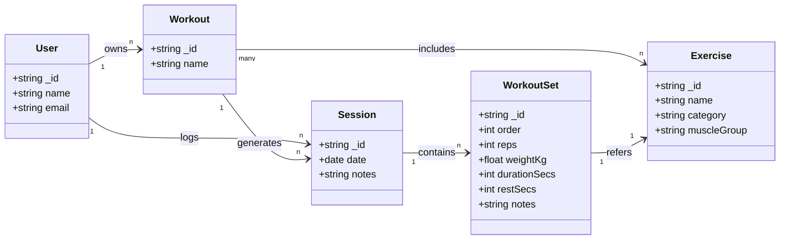
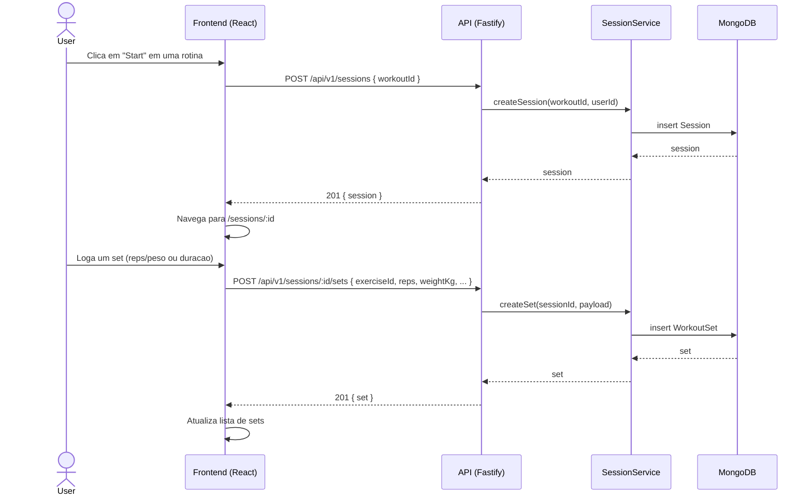

# StrongerNotes

> Plataforma web para registro e acompanhamento científico de treinos de musculação.

## 👥 Time

| Nome | Papel |
|---|---|
| Arthur Kenji Faina Fujito | Full-stack |
| Gabriel Machado Violante | Full-stack |
| Gabriel Rabelo Moura | Full-stack |
| Ian Paleta Starling | Full-stack |

---

## 🎯 Objetivo

Oferecer ao praticante de musculação um ambiente centralizado para criar rotinas de treino, registrar séries, repetições e cargas a cada sessão, e acompanhar sua evolução ao longo do tempo por meio de gráficos. A premissa é eliminar cadernos e planilhas substituindo-os por uma experiência fluida e orientada a dados.

---

## ✅ Histórias de Usuário

| # | História | Status |
|---|---|:---:|
| US01 | Como usuário, quero criar uma conta com login e senha | ✅ |
| US02 | Como usuário, quero editar as informações do meu perfil | ✅ |
| US03 | Como usuário, quero excluir permanentemente minha conta e todos os meus dados | ✅ |
| US04 | Como usuário, quero criar fichas de treino nomeadas e organizadas | ✅ |
| US05 | Como usuário, quero editar minhas fichas, adicionando ou removendo exercícios | ✅ |
| US06 | Como usuário, quero registrar peso, repetições, descanso e observações em cada série | ✅ |
| US07 | Como usuário, quero visualizar gráficos de evolução de carga por exercício | ✅ |
| US08 | Como usuário, quero visualizar gráficos de evolução de duração em exercícios aeróbicos | ✅ |
| US09 | Como usuário, quero cadastrar exercícios personalizados quando não encontrá-los na biblioteca | ✅ |

---

## 🚀 Como executar

### Pré-requisitos

| Ferramenta | Versão mínima |
|---|---|
| [Node.js](https://nodejs.org/) | 18 |
| [Docker](https://docs.docker.com/get-docker/) | qualquer |

### Iniciar com um único comando

```bash
git clone https://github.com/pl1an/StrongerNotes.git
cd StrongerNotes
./start.sh
```

O script faz tudo automaticamente:
- Verifica os pré-requisitos
- Cria os arquivos `.env` com segredo JWT gerado aleatoriamente
- Instala as dependências (`npm install`)
- Sobe o banco MongoDB via Docker
- Inicia o backend e o frontend
- Exibe as URLs e fica aguardando `Ctrl+C` para encerrar

Ao finalizar, acesse **[http://localhost:5173](http://localhost:5173)**.

---

## 🖥️ Funcionalidades

### Autenticação e perfil
- Cadastro com validação de campo por campo (nome, e-mail, senha mín. 8 caracteres)
- Login com JWT (token válido por 7 dias)
- Edição de nome/e-mail e exclusão permanente de conta

### Fichas de treino
- Criação e nomeação de rotinas (ex: "Push Day A", "Leg Day")
- Adição e remoção de exercícios com busca inline na biblioteca
- Início de sessão com um clique a partir da ficha

### Registro de sessões
- Uma sessão por treino — criada automaticamente ao clicar em "Start Session"
- Para cada exercício: registro inline de séries com **reps + peso** (força) ou **duração** (cardio)
- Edição e exclusão de séries em tempo real
- Histórico das 5 sessões mais recentes no dashboard

### Biblioteca de exercícios
- 34 exercícios públicos pré-cadastrados em 11 grupos musculares
- Filtros por categoria (Strength / Cardio) e grupo muscular
- Criação de exercícios personalizados

### Visualização de progresso
- Gráfico de linha por exercício ao longo do tempo
- **Força**: Max Weight + Estimativa de 1RM (fórmula de Epley: `w × (1 + reps/30)`)
- **Cardio**: Duração máxima por sessão em minutos
- Cards de estatísticas: melhor 1RM, evolução percentual, total de sessões
- Tabela histórica completa em ordem cronológica

---

## 🛠️ Tecnologias

| Camada | Tecnologia |
|---|---|
| Linguagem | TypeScript |
| Frontend | React 19 + Vite + TailwindCSS + Recharts |
| Backend | Node.js + Fastify |
| Banco de dados | MongoDB (Docker local / Atlas nuvem) + Mongoose |
| Autenticação | JWT (`@fastify/jwt`) + bcryptjs |
| Validação | Zod |
| Testes | Vitest + mongodb-memory-server |

---

## 🗂️ Estrutura do projeto

```
StrongerNotes/
├── back/               # API REST (Node.js + Fastify)
│   └── src/
│       ├── modules/    # exercises · workouts · sessions · users · auth
│       └── env/        # validação de variáveis de ambiente
├── front/              # SPA (React + Vite)
│   └── src/
│       ├── pages/      # Dashboard · Workout · Session · Exercises · Progress · Profile
│       ├── contexts/   # AuthContext
│       └── services/   # chamadas à API (Axios)
├── db/                 # Docker Compose + scripts de init/seed
├── start.sh            # bootstrap único
└── DEVELOPMENT.md      # processo de desenvolvimento e roadmap
```

---

## 📐 Documentacao UML (Mermaid)

Os diagramas abaixo oferecem uma visao rapida dos principais elementos do sistema e dos fluxos mais importantes para entendimento do dominio e do uso da API.

### Diagrama de classes (dominio principal)



### Diagrama de sequencia (iniciar sessao e registrar series)



---

## 🔒 Segurança

- Senhas armazenadas apenas como hash bcrypt (12 rounds)
- Rotas protegidas por JWT via `preHandler`
- Propriedade verificada por ID do token: usuário só acessa seus próprios dados (HTTP 403 caso contrário)
- Variáveis sensíveis em `.env` (nunca commitadas)

---

## 🧪 Testes automatizados

```bash
cd back
npm test
```

60 testes cobrindo todas as rotas (usuarios, auth, exercises, workouts, sessions, sets e progress).
Utilizam MongoDB em memória — não requer Docker nem banco externo.

---

## 📄 Contexto acadêmico

Projeto desenvolvido para a disciplina de **Engenharia de Software** como trabalho em equipe aplicando práticas de desenvolvimento colaborativo:
- Feature branches + Pull Requests com revisão por pares
- Padrão de commits semânticos (`feat:`, `fix:`, `docs:`)
- Testes automatizados como critério de merge
- Documentação viva (`SETUP.md`, `DEVELOPMENT.md`)
